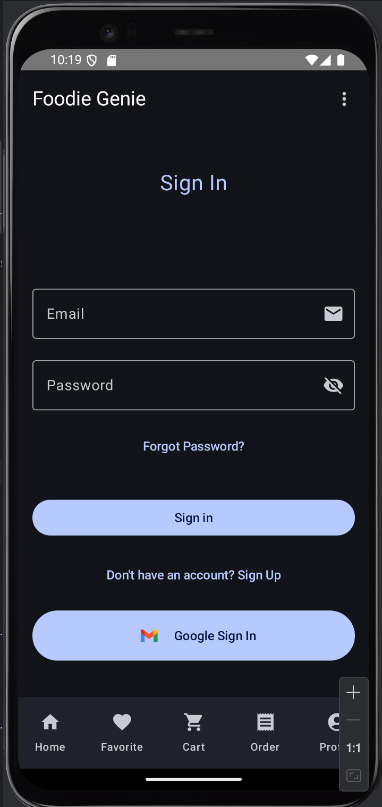
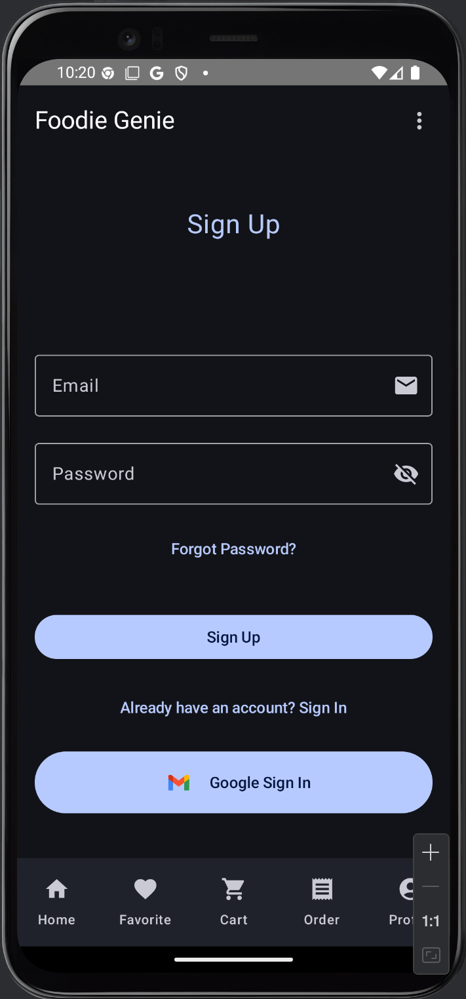

# Foodie Genie
FoodieGenie is a modern recipe discovery and shopping assistant app built for Android using Jetpack Compose and Firebase. It enables users to explore meals, add recipes to cart, place orders, and manage their profiles — all in a sleek, role-aware interface with support for both regular users and admins.

## 📑 Table of Contents
- [📱Installation & Quick Start](#-installation--quick-start)
- [👨🏻‍🏫 Introduction](#-introduction)
- [🧪 Features](#-features)
- [🖼️ App UI Preview](#-app-ui-preview)
- [📚 Pages Overview](#-pages-overview)
    - [🔐 Sign In & Sign Up Page](#sign-in--sign-up-page)
    - [🏠 Home Page](#-recipes-page-home-page)
    - [🔍 Recipe Detail Page](#-recipe-detail-page)
    - [❤️ Favorites Page](#-favorites-page)
    - [🛒 Cart Page](#-cart-page)
    - [💳 Checkout Page](#-checkout-page)
    - [🧾 Orders Page](#-orders-page)
    - [👤 Profile Page](#-profile-page)
    - [ℹ️ Info Page](#ℹ-info-page)
    - [⚙️ Settings Page](#-settings-page)
- 🧩 [Technologies Used](#-technologies-used)
- 🔥 [Firebase Setup & Configuration](#-firebase-setup-and-configuration)
- 📂 [Folder Structure](#-folder-structure)
- 🛠️ [Contribution](#-contributing)
- 📜 [License](#-license)
- 👥 [Author](#-author)

---

## 📱 Installation & Quick Start

### Step 1. Clone the Repository
```plaintext
   git clone https://github.com/MobleApp-Group4/Mobile-Project.git
   ```
### Step 2. Open in Android Studio
- Make sure Kotlin and Android SDK 33+ are installed
- Place your google-services.json file inside the app/ directory
### Step 3. Run the App
- Click "Run" in Android Studio
- Or use command line:
---

## 👨🏻‍🏫 Introduction
- FoodieGenie is a user-centric food and recipe app that integrates with Firebase for real-time authentication, storage, and data syncing. The app supports browsing curated recipes, adding them to a cart, placing orders, and even offers admin-level views for managing all orders.
---

## 🧪 Features

- 🔐 Firebase Authentication (Email + Google)
- 🍽 Browse curated recipes from API
- 🔍 Search and filter recipes by diet (Vegan, Paleo, etc.)
- ❤️ Mark recipes as favorites
- 📦 Add meals to cart and confirm order with address and time
- 📅 Date and time slot picker (Lunch / Dinner)
- 🛒 Shopping cart with quantity
- 📦 Place and track orders
- 👤 Manage profile with avatar upload
- 🧑‍💼 Role-based views (User/Admin)
- ☁️ Integrated with Firebase for real-time user data
- 🌙 Dark mode support

## 🖼️ App UI Preview
Add screenshots here for key pages like Home, Cart, Profile, Orders

## 📚 Pages Overview

### 🔐Sign In & Sign Up Page
Supports user authentication with two methods:
- **Email & Password**: Users can log in or register using traditional credentials.
- **Google Sign-In**: One-tap login using their Google account.
Upon successful login or sign-up, users are redirected to the home screen. Basic validation and error handling are included.
**Related File:** `LoginScreen.kt`
<p float="left">
  
  
</p>


### 🏠 Recipes Page (Home Page)
Displays a list of recipes with a search bar and diet-based chips filter.
**Related File:** `RecipeScreen.kt`

### 🔍 Recipe Detail Page
Browse recipes from a remote API and view detailed ingredients, instructions, and images.
**Related File:** `RecipeDetailScreen.kt`

### ❤️ Favorites Page
View your favorited recipes and navigate back to their details.
**Related File:** `FavoriteScreen.kt`

### 🛒 Cart Page
See selected recipes, adjust quantities, remove items, and proceed to checkout.
**Related File:** `CartScreen.kt`

### 💳 Checkout Page
Final step in the ordering process. Users enter delivery details (address, date, time slot, phone number, optional note) and place an order.
**Related File:** `CheckoutScreen.kt`

### 🧾 Orders Page
- **For Users:** View your own order history, including status and order details.
- **For Admins:** View, manage, and update all orders placed by users.

**Related Files:**
- `UserOrderScreen.kt`
- `AdminOrderScreen.kt`
- `OrderScreen.kt`

### 👤 Profile Page
Edit user information including name, address, gender, and upload a profile picture.
**Related File:** `ProfileScreen.kt`

### ℹ️ Info Page
Static screen for showing terms of service, privacy policy, or app information.
**Related File:** `LoginScreen.kt`

### ⚙️ Settings Page
Basic settings and logout functionality.
**Related File:** `SettingsScreen.kt`

### 🛠 Error Page
Displays UI when an error occurs (e.g., network failure).
**Related File:** `ErrorScreen.kt`

### 🔄 Loading Page
A loading indicator shown during data fetching or processing.
**Related File:** `LoadingScreen.kt`

## 🧪 Technologies Used
| Technology                        | Description                                                                                                 |
|-----------------------------------| ----------------------------------------------------------------------------------------------------------- |
| **Kotlin**                        | Main programming language for Android development. Offers type safety, null safety, and concise syntax.     |
| **Jetpack Compose**               | Android’s modern declarative UI toolkit used to build reactive and efficient UI components (`@Composable`). |
| **ViewModel (Android Jetpack)**   | Manages UI-related data in a lifecycle-conscious way. Ensures data survives configuration changes.          |
| **StateFlow (Kotlin Coroutines)** | Used for managing UI state reactively, enabling Compose to observe data changes efficiently.                |
| **Navigation Component**          | Facilitates type-safe screen-to-screen navigation with back stack management.                               |
| **Firebase Authentication**       | Handles user login, registration, and session management securely.                                          |
| **Firebase Firestore**            | Cloud-hosted NoSQL database used for storing user profiles, cart data, orders, and more.                    |
| **Firebase Storage**              | Used for uploading and serving user profile avatars.                                                        |
| **Material 3 Components**         | Google's modern design system used for UI elements like buttons, chips, dialogs, etc.                       |
| **DatePickerDialog**              | Native Android component for selecting date inputs in `CheckoutScreen`.                                     |
| **Coil (via painterResource)**    | Efficient image loading from network, used for displaying user avatars and recipe images.                   |
| **FlowRow (Compose Foundation)**  | For laying out components in a responsive horizontal flow (e.g., filter chips, tag lists, etc.)             |
| **MutableState + remember{}**     | Local state handling in Compose for fields like address, note, date, etc.                                   |


---
## 🔥 Firebase Setup and Configuration

The **Foodie Genie** app uses Firebase for its backend services, managing user accounts, order processing, shopping cart storage, recipe comments, and personalized user data like favorites. Below is an overview of how Firebase and Firestore are integrated into the project.


### 📚 Firestore Database

#### 🔹 `users` Collection

Each document represents a single user and includes:

* `userId`: UID from Firebase Auth
* `email`, `name`, `gender`, `birthday`
* `phoneNumber`, `address`, `avatar` (image URL)
* `role`: e.g., "user", "admin"
* `createdAt`: ISO timestamp

This collection stores the user's profile and general information.


##### 🔹 `favorites` Subcollection

Located inside each user document: `users/{userId}/favorites`

Each document represents a recipe that the user has favorited.

* `recipeId`: ID of the recipe

This allows users to "like" or bookmark recipes for easy access later.

##### 🔹 `cart` Subcollection

Located inside: `users/{userId}/cart`

Each document represents a recipe item the user wants to purchase.

* `recipeId`: Linked to the recipe
* `title`, `image`: Recipe details
* `quantity`: Number of servings ordered

Used to build a shopping cart before placing an order.

##### 🔹 `orders` Subcollection

Located inside: `users/{userId}/orders`

Each document represents a full user order.

* `orderId`, `userId`: Order and user IDs
* `status`: e.g., "pending", "confirmed", "delivered"
* `createdAt`: Firestore timestamp
* `address`, `phoneNumber`, `selectedDate`, `timeSlot`
* `note`: Optional user note
* `orderItems`: Array of cart items (title, image, quantity)

Orders track a user's checkout history and delivery schedule.

#### 🔹 `recipes` Collection *(Optional)*

Optionally stores basic recipe data fetched from an external API.

* `id`, `title`, `image`: Recipe preview info

This enables local caching or advanced features like search/sort/filter.

##### 🔹 `comments` Subcollection

Located inside: `recipes/{recipeId}/comments`

Each document is a user review on a specific recipe.

* `userId`, `userName`
* `rating`: 1.0–5.0 scale
* `content`: Comment text
* `timestamp`: Firestore timestamp
* `likes`: Number of likes for the comment

This supports community feedback and rating systems for recipes.

##### 🔹 `recipeDetails` Collection *(Optional)*

If detailed recipe info needs to be stored persistently:

* `id`, `title`, `image`
* `readyInMinutes`, `servings`, `summary`
* `pricePerServing`, `caloriesPerServing`, `healthScore`
* `diets`: Array of tags (e.g., vegan, keto)
* `extendedIngredients`: List of ingredient names

Useful for enabling offline access or analytics.

---
## 📁 Folder Structure
Below is the folder structure of the **Foodie Genie** project:

```plaintext
📦 foodiegenie/
│
├── 📁 api/
│   └── RecipesApi.kt
│ 
│── 📁 model/                  
│       └── Recipe.kt
├── 📁 ui/
│   ├── 📁 appbars/            
│   │   ├── BottomBar.kt
│   │   ├── DetailBottomBar.kt
│   │   ├── HomeTopBar.kt
│   │   ├── OrdersTabBar.kt
│   │   ├── ScreenTopBar.kt
│   │   ├── TabItem.kt
│   │   └── TopBar.kt
│   │
│   ├── 📁 components/             
│   │   ├── AddCommentSection.kt
│   │   ├── AdminOrderList.kt
│   │   ├── CartItem.kt
│   │   ├── CommentList.kt
│   │   ├── FilterChip.kt
│   │   ├── RatingBar.kt
│   │   ├── RecipeList.kt
│   │   └── UserOderList.kt
│   │  
│   ├── 📁 screens/                
│   │   ├── AdminOrderScreen.kt
│   │   ├── CartScreen.kt
│   │   ├── CheckoutScreen.kt
│   │   ├── ErrorScreen.kt
│   │   ├── FavoriteScreen.kt
│   │   ├── InfoScreen.kt
│   │   ├── LoadingScreen.kt
│   │   ├── LoginScreen.kt
│   │   ├── OrderScreen.kt
│   │   ├── ProfileScreen.kt
│   │   ├── RecipeDetailScreen.kt
│   │   ├── RecipeScreen.kt
│   │   ├── SettingsScreen.kt
│   │   └── UserOrderScreen.kt
│   │   
│   ├── 📁 theme/                  
│   │
│   ├── MainActivity.kt
│   └── AppScaffold.kt
│
└── 📁 viewmodel/                     
    ├── RecipeViewModel.kt
    └── UserViewModel.kt

```
---

## 🤝 Contributing
Fork the repository.
Create a new branch (git checkout -b feature/your-feature).
Commit your changes (git commit -am 'Add new feature').
Push and submit a PR 

---
## 📜 License
This project is licensed under the MIT License - see the LICENSE file for details.

---
## 👥 Author
Developed for university project by:

- Yiling Chen
- Yue Chen
- Ke Zhang


